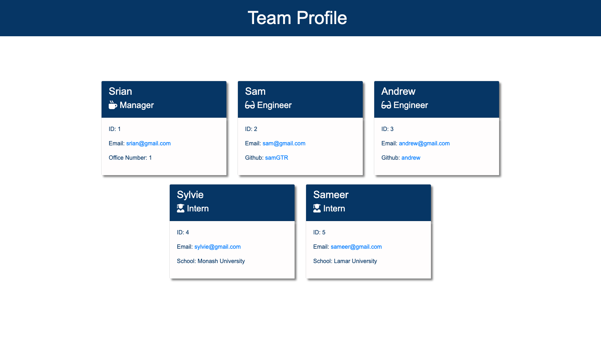

# Team Profile Generator

## Description

  This is a node.js based command line application that generates a team profile html page based on the user’s input. This project utilises Inquirer and file system module, OOP and TDD using jest.
  
## Table of Contents

  1. [Installation](#installation)

  2. [Usage](#usage)

  3. [Contributing](#contributing)

  4. [Tests](#tests)

  5. [Links](#links)

  6. [Questions](#questions)

  7. [License](#license)

## Installation

  - Clone the application repository from: https://github.com/SamGTR/Team-Profile-Generator.git
  - Install Node.js.
  - Install inquirer npm package.
  - Install Jest for testing.

## Usage

  Type node index.js in the terminal. Then answer the questions prompted. Please refer to the walkthrough video [link](#links) for detailed instructions on application usage.
  

## Contributing

  Contributions are accepted for improving the application.

## Tests

  Type 'npm test' in the terminal for running Jest tests.

## Links

  Following is the link to the Github repository for Team Profile Generator application:  
  https://github.com/SamGTR/Team-Profile-Generator

  Following is the link to walkthrough video demonstrating the functionality of the application:
  https://drive.google.com/file/d/140GgQzKYCy2F21X4iOWFWCTSBvqFquIm/view?usp=sharing

## Questions

  Follow me on Github [@SamGTR](https://github.com/SamGTR)

  For any questions, reach out to sgpmecha@gmail.com

## License

  MIT